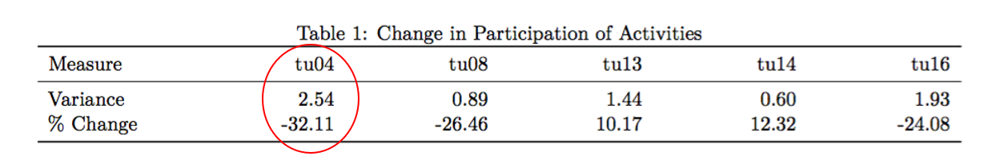
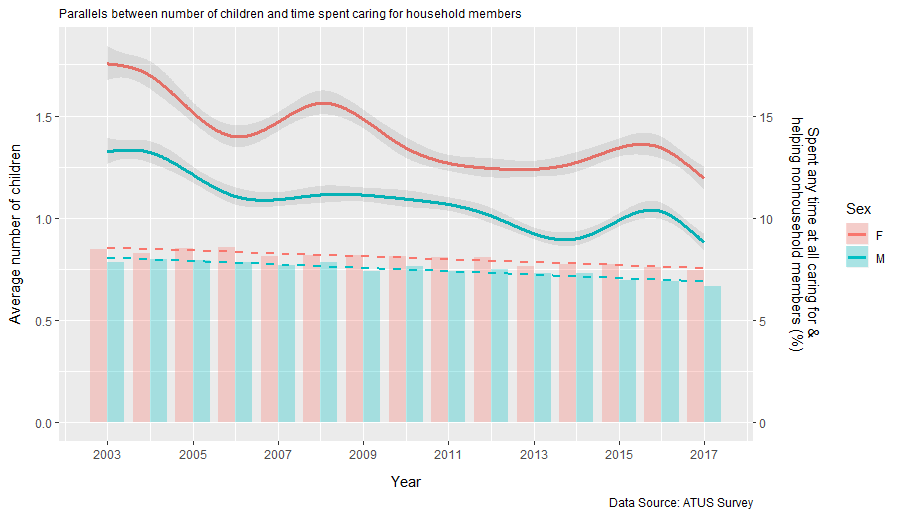
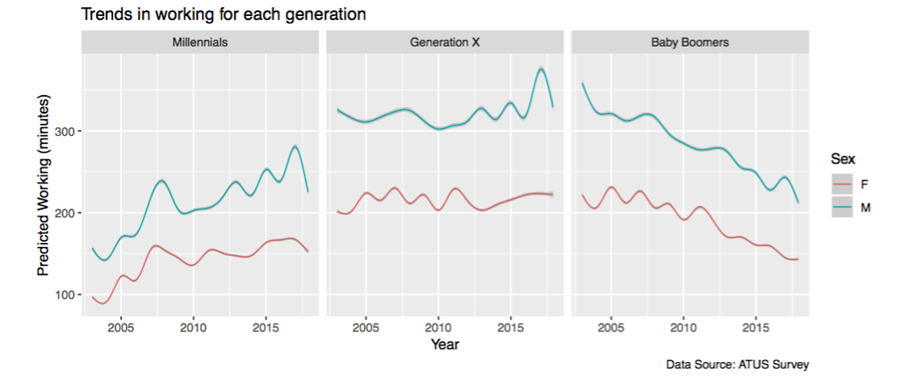
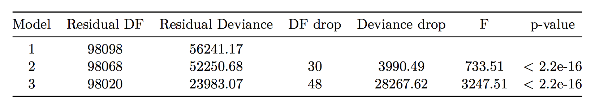
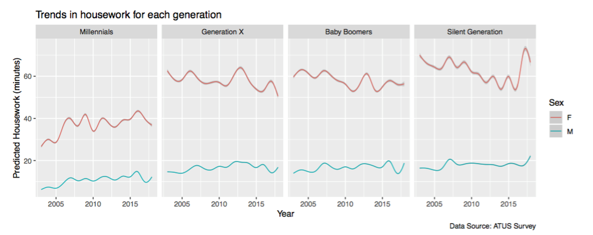
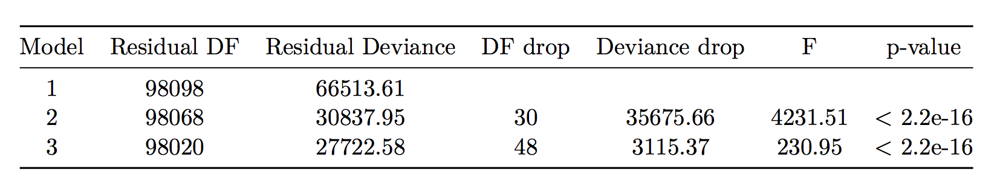
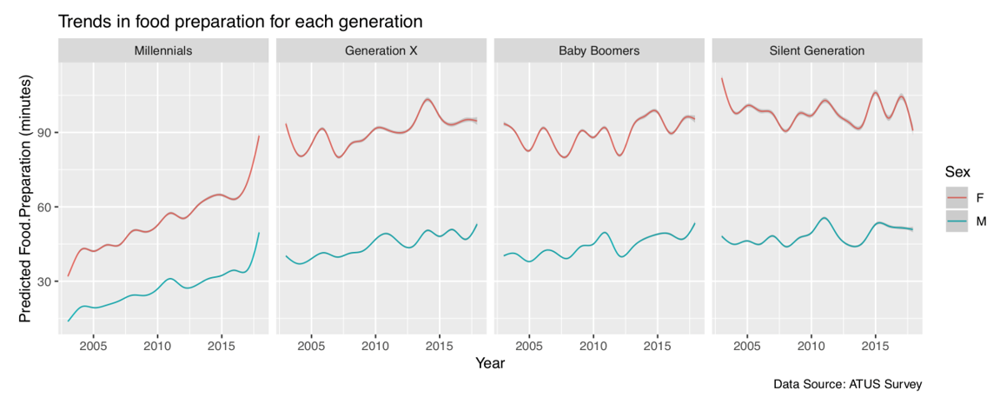
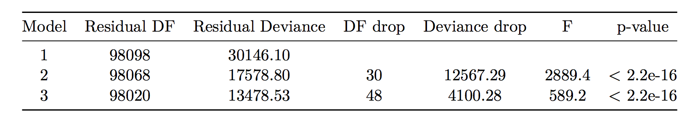
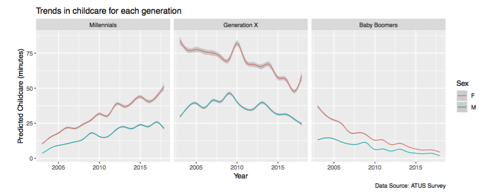

output: 
  beamer_presentation:
    theme: "Goettingen"
    fonttheme: "professionalfonts"
    slide_level: 2
    toc: true
header-includes:
  - \usepackage{wrapfig}
link-citations: yes
bibliography: Final-Report-References.bib
csl: ieee.csl
---

```{r, echo=FALSE, message=FALSE, warning=FALSE}
library(knitr)
```

# Introduction

## Introduction

The ATUS dataset [@atusdatasets] used is based on research carried out as part of the American Time Use Survey [@ATUS] from 2003 to 2017, containing time use data for 431 different activities grouped into 17 over-arching categories.

**Aim:**
Hypothesise, validate and present long-term trends based on the data

**Approach:**  

- EDA  
    + The dataset was split and the even months were used for exploration and model training (July excluded and used for validation);
- Validation using left out “unseen” data
    + Formal hypothesis tests on the initial beliefs from the EDA using the odd months (including July) as the validation data; 
- Summary plots of findings

## Tidying and Structuring the Data

- Missing values were confined to 9 columns of factor variables so these were removed

- The 17 categories were built from the activity data

- As the aim is to present long-term trends, weighted means for **each year** were calculated
    + This allows for comparisons and ensures that each group is correctly represented in the population
\vspace{7pt}

The weighted means are then calculated using $$\overline{T_j} = \frac{\sum_{i} weight_i T_{ij}}{\sum_{i} weight_i}$$
where $i$ corresponds to the individual, and $j$ corresponds to the type of individual


# Observation 1:

## Participation in Caring for & Helping Non-HH Members
\fontsize{9}{9}
\setbeamerfont{itemize/enumerate subbody}{size=7}
### Exploratory Data Analysis
  
- Activities with % change larger than 10% and variance greater than 0.5



- Fitting a linear model and performing best subsets regression with `Year` forced in as an explanatory variable gives `Sex` and `Number of Household Children`  
  \vspace{8pt}
- Fit a more complex model: glm with log link and multiplicative errors
    + Use natural cubic splines to show fluctuations
    + $tu04 participation \sim -1 + Sex + Sex:ns(Year, knots = 2003, 2005, ..., 2017)$  
  \vspace{8pt}
- Performing an $F$-test on the model shows this is a significant improvement on $tu04 participation \sim -1 + ns(Year, knots = 2003, 2005, ..., 2017)$

## Observation 1:
\vspace{8pt}
\setbeamerfont{itemize/enumerate subbody}{size=7}
\begin{columns}
  \column{0.6\textwidth}
  \centering
    \includegraphics[height = 1\textheight, width = 1.1\textwidth]{Training Plot.png}
  \column{0.38\textwidth}
  \fontsize{8}{8}
  \begin{itemize}
    \item The plot indicates that over the period, the participation in `tu04` has decreased for both men and women
    \vspace{3pt}
    \item Changes in the `average no. of household children` seem to follow the trend in participation, however the link is weak (correlations of 0.65 for Men and 0.49 for Women)
  \end{itemize}
\end{columns}  

A one-sided $t$-test on a linear model simplification of the generalised linear model without splines - $(tu04 participation \sim Year + Sex)$ - gives a $p$-value of **5.7e-09** << 0.05

## Validation

Formal one-sided $t$-test on linear model build on *validation data* gives a $p$-value of **1.4e-07** << 0.05
\vspace{10pt}

\setbeamerfont{itemize/enumerate subsubbody}{size=6}
\begin{columns}
  \column{0.5\textwidth}
  \centering
    \includegraphics[height = 1\textheight, width = 1\textwidth]{Residual Plot.png}
  \column{0.48\textwidth}
  \fontsize{8}{8}
  \begin{itemize}
    \item To test the suitability of the model on the validation dataset a residual plot was created
    \vspace{6pt}
    \item The errors:
    \begin{itemize}
      \item Are uncorrelated
      \item Have mostly equal variance
      \item Seem to have mean 0
  \end{itemize}
\end{itemize}
\end{columns}

Performing a formal $t$-test when `average number of household children` is added confirms that this has a significant effect on participation in `caring for & helping non-household children`

## Final Plot Built On All Data Excluding July



# Observation 2:

## How Time Spent on Traditionally Gendered Activities has Changed as Gender Roles have Broken Down?

\begin{columns}
  \column{0.48\textwidth}
  \centering
  \includegraphics[height = 1\textheight, width = 0.9\textwidth]{Table 2.png}
  \column{0.48\textwidth}
  \centering
    \includegraphics[height = 1\textheight, width = 0.9\textwidth]{Table 3.png}
\end{columns}
\fontsize{5}{5}
- Table 2 is a simplified version of Talcott Parsons’ [@10.2307/2085686] study on gender roles
- Table 3 shows how to break down the respondents into different generational groups [@generations]  

\fontsize{12}{12}
- Division between genders in terms of societal roles is consistently featured in the news; evident in the “\#MeToo” movement amongst others
\vspace{5pt}
- The report aimed to investigate how this division changed over the given period through investigating long-term trends in each of the traditional gender activities

## Exploratory Data Analysis

\setbeamerfont{itemize/enumerate subsubbody}{size=7}
- The first stage of the analysis looked at participation rates at a total population level for the different activities to check they were popular enough for comparison
\vspace{5pt}
- Following this initial check, general linear models were developed for all suitable activities and different parameters were checked including: 
    + Sex
    + Year
    + Generation
    + Region
\vspace{5pt}
- After performing formal F-tests and comparing simpler models, the following model was settled upon for all activities  
  
\fontsize{7}{2}
$Activity \sim -1 + ns(Year) + Sex + Sex:ns(Year, knots = 2003, 2005, ..., 2017) + Generation + Generation:ns(Year, knots = 2003, 2005, ..., 2017)$  

- The simpler models were variants of this model, but without sex or generational information 

## House Maintenance and Vehicle Maintenance (Males)

- The participation rate was too low to warrant deeper analysis
\vspace{5pt}
- Whilst the findings represented that there existed a separation in gender, the participation rates of around 3% for both reflected that these were more uncommon activities
\vspace{5pt}
- It was decided that there was not enough data to reflect the time spent on these activities in a suitable linear model

\begin{columns}
  \column{0.5\textwidth}
  \centering
    \includegraphics[height = 1\textheight, width = 1\textwidth]{House Maintenance.png}
  \column{0.5\textwidth}
  \centering
    \includegraphics[height = 1\textheight, width = 1\textwidth]{Vehicle Maintenance.png}
\end{columns}

## Validation

\fontsize{10}{10}
- **Males:** Working, House Maintenance and Vehicle Maintenance;
\vspace{9pt}
- **Females:** Housework, Cooking and Childcare
\vspace{9pt}
- The models shown on the following slides showcase the results of the analysis, plotting all of the data with the exception of July as required
\vspace{9pt}
- Despite using 11 months of the data here, it is critical to reiterate that all of the EDA and validation was carried out on entirely separate 6 month subsets of each year to ensure validity of the conclusions and testing
\vspace{9pt}
- Formal one-sided $t$-test were performed on the simple linear model below for each activity, using weighted yearly averages for the data

\centering \textit{Gender time difference} $\sim$ *Year*

## Validation - Working



\fontsize{7}{7}
- The plots show the changes in working patterns between 3 generations. There's an increase in working time for *Millenials* as this generation begin to work. Likewise, there's a decrease in time for *Baby Boomers* as many of this generation begin to retire. 
\vspace{5pt}
- *Generation X* shows that there is an increase in women working time and for, the first 13 years, a decrease in time working for men. There is a slight uptick for men working in 2016, however, this begins to return to previous lower levels in 2017. 
\vspace{5pt}
- The $t$-test on a population level for this gave a $p$-value of 0.047 < 0.05
\vspace{5pt}
- The $F$-test is shown below


## Validation - Housework



\fontsize{7}{7}
- Except for *Millennials*, all generations have the decrease in time spent on housework. But the decrease for women is sharper than any *increase* for men, which is clear through observation of *Generation X*.
\vspace{5pt}
- On the other hand, the gap seems to have increased slightly for *Millennials* - both sexes are increasing the amount of time spent on housework, there is a confounding effect of increased time due to age / moving out.
\vspace{5pt}
- Notably, *Millennials* also spend less time doing housework than the others.
\vspace{5pt}
- The $t$-test on a population level for this gave $p$-value of 6.8e-05 << 0.05
\vspace{5pt}
- The $F$-test is shown below


## Validation - Cooking



\fontsize{7}{7}
- Both genders from all the generations other than the *Silent Generation* are actually spending more time than previously on food preparation
\vspace{5pt}
- For men, there is a sharper increase than in time spent by women which is evidence of erosion in this particular gender stereotype
\vspace{5pt}
- Notably, *Millennials* spend more and more time on cooking and the nearly same increasing rate of both gender leads to the small gap
\vspace{5pt}
- The $t$-test on a population level for this gave $p$-value of 0.0054 << 0.05
\vspace{5pt}
- The $F$-test is shown below



## Validation - Childcare



\fontsize{10}{10}
- Note that the drop off for women is sharper than it is for men, leading to a convergence in the weighted means for both.
\vspace{5pt}
- The $t$-test on a population level for this gave a $p$-value of 0.037 < 0.05
\vspace{5pt}
- The $F$-test is shown below


# Limitations of the Data

## Limitations of the Data

- 15 years is a relatively short period within which to observe long term trends
\vspace{10pt}
- Sporadic subset sizes due to the filtering and sub-setting required
\vspace{10pt}
- The reliance on people to remember the way in which they spend their time (i.e. They could forget smaller tasks and focus on more memorable or time-consuming ones)
\vspace{10pt}


# References

## References


 
