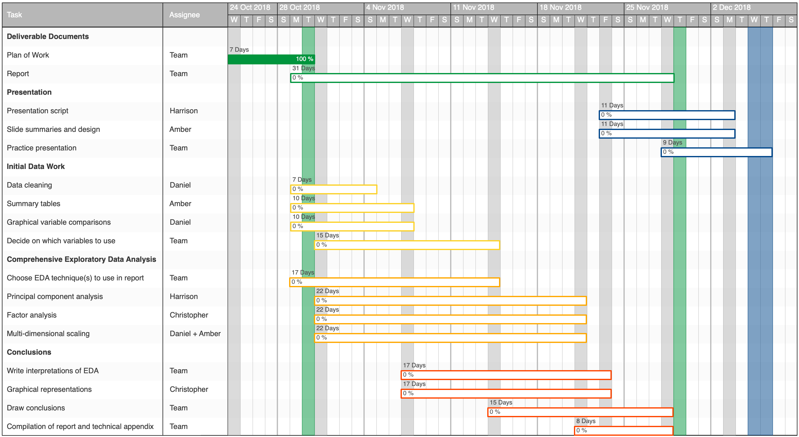

## The Task

The American Time Use Survey (ATUS) is a study run continuously by the US Bureau of Labour Statistics for the past 15 years, asking respondents how they spent their time on the previous day. The given task is to explore the ATUS data and provide a report that will inform a US newspaper’s journalists about some of the main changes that have occurred in how people spend their time. The project is to be concluded with a presentation of the findings and summaries of undertaken analysis.

## Schedule and Methodology

\begin{center} \textbf{Figure 1: Gantt Chart of Group July's Project Schedule \textit{(subject to review at meetings)}} \end{center}

The nature of this project means that exploratory data analysis is vital: deeper data analysis cannot begin until the relationship(s) for further investigation have been identified. For this reason a variation of the agile project management methodology will be followed. This will allow for a flexible approach, performing exploratory analysis in stages to ensure the most rigorous and interesting conclusions are reached. Hourly meetings are scheduled every Wednesday (marked in grey on the Gantt chart) for the duration, with additional scheduled towards the end to ensure deliverables are on track for completion. Progress reports and outlooks will also comprise part of these meetings.

## Risks

The major risks to this project are the occurrence of unforeseen delays in the exploratory data analysis for the reasons alluded to above. To mitigate this, time buffers and contingencies have been incorporated such that all tasks will be completed promptly.

Another major risk is that one of the team members falls ill unexpectedly. To avoid this being an issue, the work-plan was developed such that there is a balanced load on each member and utilising GitHub means that a team member's contributions can be accessed by the whole team at any time with minimal delay. Furthermore, it will be possible to rearrange meetings - if deemed necessary.

As with any group project, there is a risk that lack of communication could cause a task to be repeated unnecessarily. The use of GitHub's project management tools (including repositories and Kanban board) will allow these errors to be mitigated and enable collaboration.